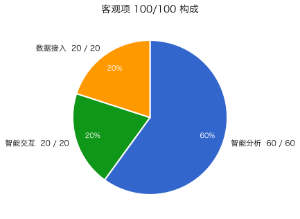

# TableTalker

> 上传 CSV / Excel + 一句中文问题，**30 秒拿到带证据的交互式 HTML 报告**。

每个数字都挂可复算证据，多轮追问保留上下文，数据不支持的问题主动拒答。

---

## 能干什么

| 能力 | 说明 |
|---|---|
| 一次分析 | CSV / Excel + 自然语言提问 → 带证据的交互式 HTML 报告（多类图表、关键发现、业务建议） |
| 多轮追问 | 父轮的发现、客群定义、图表锚点、上传文件自动继承，代词无需澄清 |
| 保守拒答 | 字段缺失 / 维度错配 / 诱导幻觉 / 越权请求 四类陷阱，固定话术拒答而非编造 |
| 批量与历史 | manifest 驱动并发批量评测 + SQLite 持久化历史索引（搜索 / 筛选 / 详情） |

---

## 表现如何

| 维度 | 当前值 |
|---|---:|
| 客观项自测分 | 89 / 100 |
| 主分析成功 / 证据完整率 | 18 / 20 · 100% |
| 陷阱拒答（宽松 / 严格） | 10 / 10 · 9 / 9 |
| 误拒率 | 0% |
| 追问成功率 / 上下文继承 | 94.4% · 94.4% |
| P50 / P95 端到端 | 72.8s / 174.6s |



完整 9 节官方格式报告见
[`自测报告/latest_evaluation_metrics.md`](自测报告/latest_evaluation_metrics.md)，
所有数字来自真实评测运行，未手填。

---

## 试一下

- **公网入口**：https://table-talker-frontend-ai-llm.apps.dc2.asiainfo.com/ （免登录）
- **启动**（任选其一）：
  ```bash
  # ① 直接拉源码跑
  bash 运行脚本/start.sh

  # ② docker-compose
  docker compose up --build

  # ③ k8s（OpenShift 同 manifest 用 oc apply）
  kubectl apply -f k8s/ -n <namespace>
  ```
  前端 http://localhost:3000，后端 http://localhost:8000
- **依赖**：Python 3.11+ (uv) · Node 20+ (pnpm) · 亚信 LLM 网关账号
- **配置**：参考 `.env.example`

---

## 去哪儿看细节

| 想知道什么 | 文档 |
|---|---|
| 设计取舍（Typed Plan / 二段式 LLM / 双层会话状态 / 模型选型） | [`架构文档/design_doc.md`](架构文档/design_doc.md) |
| 提交契约 / 字段定义 | [`docs/submission-contract.md`](docs/submission-contract.md) |
| 拒答策略与统一话术 | [`docs/refusal-policy.md`](docs/refusal-policy.md) |
| 评分项映射 | [`docs/scoring-map.md`](docs/scoring-map.md) |
| 产品定位 | [`PRODUCT.md`](PRODUCT.md) |
| 能力清单 | [`knowledge-base/product-capabilities.md`](knowledge-base/product-capabilities.md) |

---

[Apache 2.0](LICENSE)
