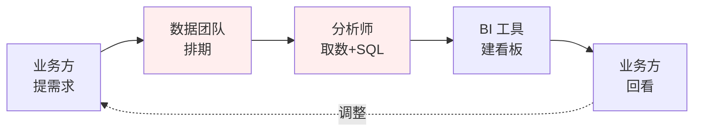
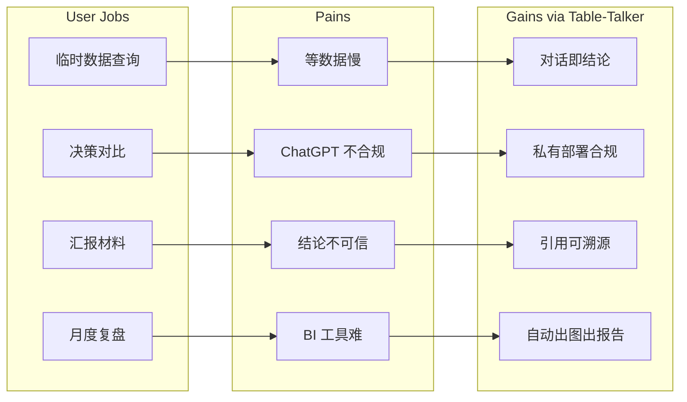
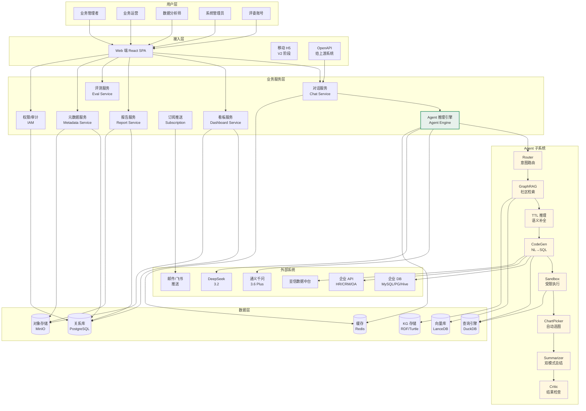
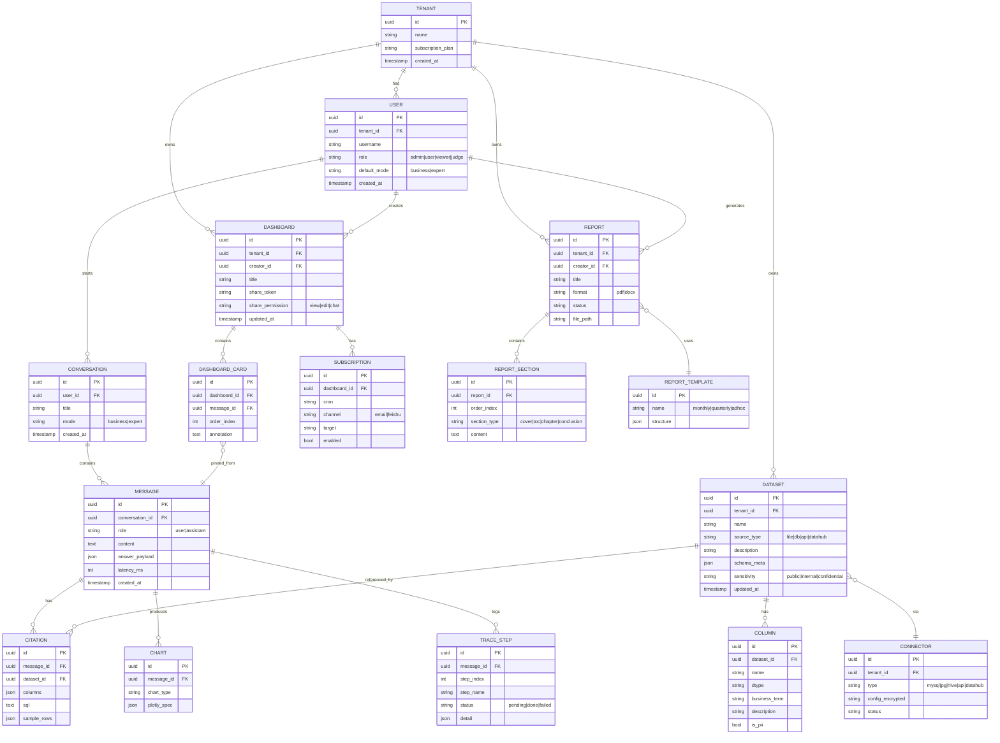
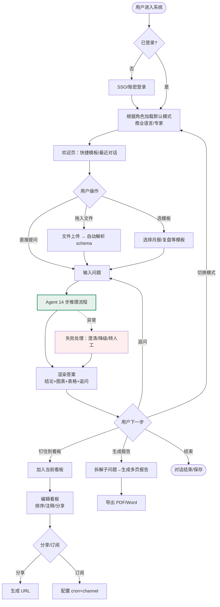
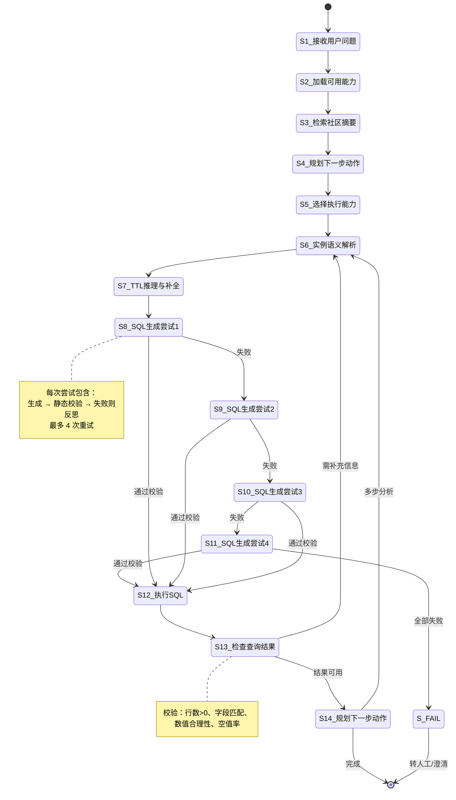
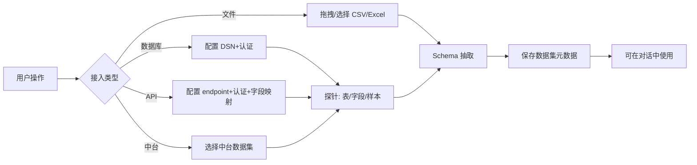
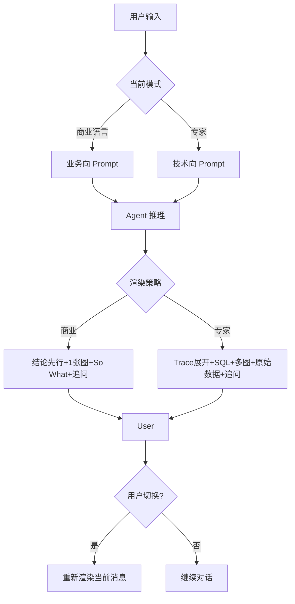
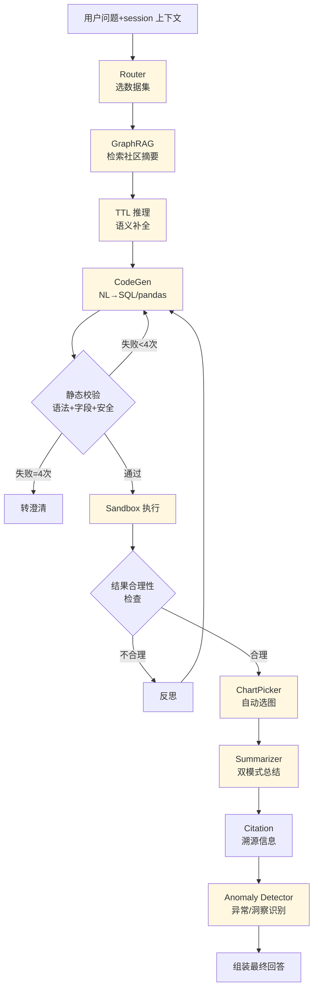
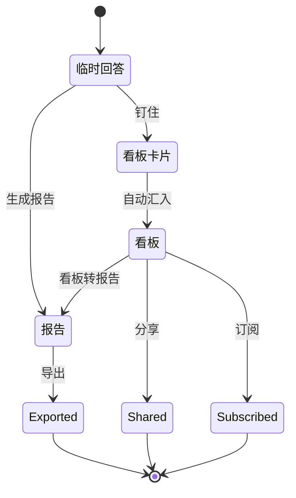

# Table-Talker PRD v1.0

> 面向企业常规管理的 AI 原生对话式数据分析与洞察平台

| 项目 | 内容 |
| --- | --- |
| PRD 审核人 | [TODO: 队长 张扬 / 评审委员会] |
| 重要性 | 高 |
| 紧迫性 | 高（5/10 18:00 初赛截止） |
| 需求方 | 亚信 AIC（参赛单位）；最终用户：企业业务管理者、业务运营、数据分析师 |
| PRD 编写人 | 巧玲（Table-Talker 团队） |
| PRD 提交日期 | 2026-05-03 |
| 产品定型 | 商业化产品 × 工具型软件（带平台属性） |

## PRD 修改记录

| 变更时间 | 变更内容 | 变更提出部门与理由 | 修改人 | 审核人 | 版本号 |
| --- | --- | --- | --- | --- | --- |
| 2026-05-03 | 初始版本：明确 MVP = 完整功能愿景，覆盖比赛 + 商业化双目标 | Table-Talker 团队 | 巧玲 | [TODO] | v1.0 |

---

## 1、项目背景

> 💡 方法论提示：用 **PESTEL（外部宏观）+ 5 Forces（竞争）+ Pain-Point（用户）** 三视角组织背景。

### 1.1 宏观背景

- **AI 原生应用元年**：2024-2025 年大模型从"能写文章"进化到"会写 SQL、看图说话、做长链路推理"，结构化数据分析进入"对话即查询"时代。
- **国产大模型可商用**：通义千问 3.6 Plus、DeepSeek 3.2 等在 NL2SQL 与商务理解上达到 GPT-4 80%+ 水平，且成本与合规优势明显。
- **企业 AI 优先战略**：以亚信为代表的科技企业明确"AI 优先"路线，从研发工具到客户服务到管理决策全面 AI 化。
- **黑客松催化**：2026 亚信黑客马拉松大赛初赛赛题四「结构化数据智能分析与洞察」直接对标该方向，是产品孵化与品牌打响的最佳跳板。

### 1.2 行业现状（结构化数据消费链路）



链路平均耗时 **1-7 天**，每个环节都是损耗点：业务方等不及、分析师重复劳动、BI 看板覆盖不到长尾需求。

### 1.3 三类核心用户的痛点

| 用户 | 现状 | 痛点 |
| --- | --- | --- |
| 业务管理者（VP/总监） | 想看数 → 提需求 → 等 1-3 天 → 数据来了不对 → 再提 | 决策被动、错过窗口、无法自助探索 |
| 业务运营（HR/财务/销售运营） | Excel/PowerBI 折腾 2-3 小时，跨表关联做不出 | 时间成本、专业门槛、无法做深度分析 |
| 数据分析师 | 80% 时间在做"重复性、临时性"取数 | 无法做真正深度分析、价值感低 |

### 1.4 现有解决方案的不足

- **Tableau/PowerBI**：拖拽语法学习曲线陡，且为持续看板设计，不适合临时性问题。
- **ChatGPT + Code Interpreter**：通用强但 ① 数据合规阻断企业落地 ② 无法连企业数据源 ③ 无业务术语理解。
- **NL2SQL 开源工具（Vanna 等）**：只解决"NL→SQL"单点，缺多轮、可视化、洞察生成、双模式 UX。
- **企业自建 BI**：固化看板，无法应对"非预设"问题。

→ **Table-Talker 切入"对话式 + 私有部署 + 业务理解 + 三态输出"的全新象限。**

---

## 2、需求基本情况

### 2.1 需求来源

| 来源 | 说明 |
| --- | --- |
| 大赛驱动 | 2026 亚信黑客马拉松初赛赛题四「结构化数据智能分析与洞察」 |
| 战略驱动 | 公司"AI 优先"战略，需要标杆性 AI 原生工具产品 |
| 用户驱动 | 内部 HR/财务/运营同事访谈反馈"数据消费效率低"是普遍痛点 |
| 竞品驱动 | ThoughtSpot、DataChat、Numbers Station 等海外标杆，国内空白 |

### 2.2 用户角色

| 角色 | 定义 | 典型动作 | 占比预估 |
| --- | --- | --- | --- |
| 业务管理者 | 部门 Leader / 总监 / VP / C 级 | 问业务问题、看结论、导报告、分享看板 | 30% |
| 业务运营 | HR/财务/销售/市场 Ops，分析任务但非分析师 | 跨表分析、做月报、追指标 | 50% |
| 数据分析师 | 数据团队 / BI 团队 | 加速取数、用作草稿、调优 SQL | 15% |
| 系统管理员 | IT/数据平台运维 | 接数据源、配权限、监控用量 | 5% |

### 2.3 用户目标

- 业务管理者："**5 秒钟拿到结论**，能直接讲给老板听"
- 业务运营："**5 分钟做完月报**，自动出图自动写文字"
- 数据分析师："**5 倍效率**写复杂 SQL 与 Notebook"
- 系统管理员："**5 分钟接入新数据源**，零代码配置"

### 2.4 业务目标

| 维度 | 短期（5/10 初赛） | 中期（5/24 决赛） | 长期（2026 Q4 商业化） |
| --- | --- | --- | --- |
| 比赛 | 初赛晋级 8 强 | 决赛 Top 3 | — |
| 用户 | 评委 + 团队内部 | 公司 50+ 人内测 | 5 个外部客户付费 |
| 数据源 | 文件上传跑通 | + 1 个 DB connector | + 3 类数据源（DB/API/中台） |
| 输出形态 | 聊天 + 看板 + 报告 | 全部三态稳定 | 三态 + 订阅推送 |

---

## 3、商业分析

> 💡 方法论提示：商业化产品需呈现 **市场（TAM/SAM/SOM）+ 竞品（4Ps 对位）+ 价值主张（VPC）+ 商业模式（BMC 简化）**。

### 3.1 市场规模

| 维度 | 数字 | 来源 |
| --- | --- | --- |
| TAM（全球 BI/Analytics 市场） | 约 360 亿美元（2025） | Gartner / IDC |
| SAM（中国企业 AI 数据分析） | 约 120 亿人民币（2025-2026） | 艾瑞咨询 / IDC China |
| SOM（亚信目标客户群） | [TODO: 由 BD 团队结合亚信现有 5000+ 企业客户测算] |

### 3.2 竞品分析

| 维度 | Tableau | PowerBI | ChatGPT+CI | Vanna AI | 自建 BI | **Table-Talker** |
| --- | --- | --- | --- | --- | --- | --- |
| NL 对话 | ❌ | 弱 | ✅ | ✅ | ❌ | **✅✅ 双模式** |
| 私有部署 | ✅(贵) | ✅(贵) | ❌ | ✅ | ✅ | **✅** |
| 自动可视化 | 拖拽 | 拖拽 | ✅ | ❌ | 拖拽 | **✅ 自动选图** |
| 多轮上下文 | ❌ | 弱 | ✅ | ❌ | ❌ | **✅** |
| 看板生成 | ✅✅ | ✅✅ | ❌ | ❌ | ✅ | **✅（聊天→钉住）** |
| 报告导出 | ✅ | ✅ | 弱 | ❌ | ❌ | **✅（自动多页）** |
| 业务术语理解 | ❌ | ❌ | 弱 | ❌ | ❌ | **✅ TTL+GraphRAG** |
| 引用溯源 | ✅ | ✅ | 弱 | ✅ | ✅ | **✅** |
| 学习成本 | 高 | 中 | 低 | 中 | 高 | **极低** |
| 单用户价格 | $70/月 | $10/月 | $20/月 | OS免费 | 高昂 | [TODO: 待定价] |

### 3.3 价值主张（VPC）



### 3.4 商业模式

| 维度 | 内容 |
| --- | --- |
| 客户细分 | 中大型企业（500 人+）；优先 IT/电信/金融/政企（亚信存量客户） |
| 价值主张 | 让企业每个人都有"私人数据分析师" |
| 渠道 | 亚信销售直销 + 黑客松品牌曝光 + ISV 合作 |
| 客户关系 | 私有化交付 + 年度续约 + 增值服务 |
| 收入流 | ① License（按用户数/年） ② 私有化部署费 ③ 行业模板订阅 ④ 实施服务 |
| 关键资源 | 大模型 API、领域 schema 知识库、Agent 框架 |
| 关键活动 | 模型路由优化、行业模板沉淀、客户案例 |
| 关键合作 | 通义千问 / DeepSeek（模型）、亚信云（基础设施）、客户业务部门（共建） |
| 成本结构 | 大模型调用费、研发、销售、实施 |

### 3.5 风险与机会

- **机会**：① AI 原生 BI 是行业重塑窗口期 ② 国产模型政策利好 ③ 亚信品牌+客户基础
- **风险**：① 大厂会跟进（火山引擎、百度智能云）② 客户数据治理成熟度低 ③ 大模型幻觉

---

## 4、项目收益目标

### 4.1 比赛收益指标（短期 KPI）

| 指标 | 目标 | 衡量方式 |
| --- | --- | --- |
| 初赛晋级 | 进入 8 强 | 5/18 公布晋级名单 |
| 决赛排名 | Top 3 | 5/24 颁奖 |
| metrics 综合分 | ≥ 0.85 | 自测报告 metrics 文件 + 隐藏数据集复测 |
| 演示视频完成度 | 100% | 含配音/字幕、覆盖功能+架构+AI算法 |
| UI 可访问性 | 100% | 内网部署可用，含批量评测+下载 |

### 4.2 产品收益指标（中长期 KPI）

| 维度 | 6 个月 | 12 个月 |
| --- | --- | --- |
| 内部用户 | 100 人活跃 | 500 人活跃 |
| 外部签约客户 | 3 家 | 10 家 |
| ARR | 100 万 | 500 万 |
| 关键场景模板 | 5 个（HR/财务/销售/运营/客户分析） | 15 个 |

### 4.3 用户体验指标

| 指标 | 目标值 | 测量方式 |
| --- | --- | --- |
| Time-to-First-Insight | < 30 秒 | 用户从发问到看到第一张图的时间 |
| 答案正确率 | ≥ 85% | 隐藏评测集 |
| 引用溯源准确率 | ≥ 95% | 评测脚本 |
| NPS | ≥ 50 | 内部问卷 |
| 7 日留存 | ≥ 60% | 后台埋点 |

### 4.4 技术指标

| 指标 | 目标值 |
| --- | --- |
| 单查询平均时延 | < 8s |
| 系统可用率 | 99.5% |
| 支持数据集量级 | 单表 1000 万行 |
| 并发对话数 | ≥ 50 |

---

## 5、项目方案概述

### 5.1 整体方案

> Table-Talker = **统一聊天入口** × **AI Agent 推理底座** × **三态输出（聊天/看板/报告）** × **多源数据接入**

### 5.2 核心创新点

| 创新点 | 说明 | 价值 |
| --- | --- | --- |
| **双模式 UX**（商业语言 / 专家） | 同一个 Agent 后端，两种 UI 与 Prompt 风格，按用户身份/手动一键切换 | 一个产品同时满足管理者+分析师，避免"一刀切" |
| **三态统一**（聊天→看板→报告） | 聊天为入口，"钉住"形成看板，"导出"形成多页报告，全程不离开对话流 | 从临时查询到沉淀输出无缝衔接 |
| **GraphRAG + TTL 语义底座** | 基于 RDF/Turtle 本体的业务术语理解 + GraphRAG 社区检索做语义补全 | 解决"业务术语 ≠ 数据库字段"的核心痛点，准确率显著高于纯 NL2SQL |
| **多次 SQL 重试 + 自检** | 模型生成 SQL 后自动执行→检查结果→失败重试，最多 4 次 | 显著提升复杂查询成功率 |
| **多模型路由** | 小模型做意图识别/SQL 校验，大模型做最终报告生成 | 成本优化 + 时延优化 |
| **引用溯源** | 每条结论可点开看：用了哪个数据集、哪几列、跑了什么 SQL、原始数据 | 解决 LLM 幻觉信任问题 |

### 5.3 关键技术栈

| 层 | 选型 | 备注 |
| --- | --- | --- |
| 前端 | React + Vite + Tailwind + Plotly.js | 双模式 UI、看板、报告 |
| 后端 | FastAPI + Pydantic + asyncio | 类型安全、流式接口 |
| Agent | LangGraph + 自写 ReAct loop | 状态机式控制流 |
| 数据查询 | DuckDB + pandas + SQLAlchemy | DuckDB 直读 CSV/Parquet/DB |
| 向量库 | LanceDB / Milvus | GraphRAG 社区索引存储 |
| 知识图谱 | RDFLib + Turtle 文件 | 业务术语本体 |
| 缓存 | Redis | Session、查询缓存 |
| 报告渲染 | python-docx + reportlab | Word/PDF 导出 |
| 部署 | Docker Compose / K3s | 一键部署 |
| 大模型 | 通义千问 3.6 Plus（主）+ DeepSeek 3.2（备） | 部署期强制使用 |

---

## 6、项目范围

### 6.1 MVP 功能清单（=完整愿景，本版"全功能 MVP"）

> 用户决策：**MVP 不缩范围**，全部功能进 MVP，5/10 前完整交付。本节为完整功能清单。

#### 6.1.1 数据接入（4 类全要）

| 编号 | 功能 | 优先级 | 说明 |
| --- | --- | --- | --- |
| F-DA-01 | 文件上传（CSV/Excel/Parquet） | P0 | 拖拽 / 点击；自动识别 schema；支持 ≤ 100MB |
| F-DA-02 | 数据库 Connector（MySQL/PG/Hive/StarRocks） | P0 | URL/账密配置；自动 schema 同步；DSN 加密 |
| F-DA-03 | 业务系统 API Connector（HR/CRM/OA） | P0 | 配置化 connector：URL+认证+字段映射；先支持 RESTful JSON |
| F-DA-04 | 亚信数据中台对接 | P0 | 通过中台开放 API 拉取数据集元数据 + 查询接口 |
| F-DA-05 | 数据集元数据管理 | P0 | 列描述、业务术语、敏感等级；支持手动编辑 |

#### 6.1.2 双模式对话

| 编号 | 功能 | 优先级 | 说明 |
| --- | --- | --- | --- |
| F-CH-01 | 单轮对话 | P0 | NL 输入 → 完整答案 |
| F-CH-02 | 多轮对话 | P0 | Session 内上下文继承，支持 "再按 X 看一下" 这种省略 |
| F-CH-03 | 商业语言模式 | P0 | 默认；结论先行 + 自动总结 + So What |
| F-CH-04 | 专家模式 | P0 | 显示 Trace、SQL、详细推理；支持手动改 SQL |
| F-CH-05 | 模式切换 | P0 | 顶部 toggle 一键切换 + 用户身份自动判断默认 |
| F-CH-06 | @mention 数据集 | P0 | `@employee_data` 强制使用指定数据集 |
| F-CH-07 | 拖入文件直接问 | P0 | 拖文件到对话框 → 自动加载 → 直接问 |
| F-CH-08 | 模板选择 | P0 | "帮我做月度复盘" → 模型自动拆问题 |
| F-CH-09 | 历史对话 | P0 | 左侧栏列表，可恢复、重命名、删除 |
| F-CH-10 | 对话分享 | P0 | 生成分享链接（带权限） |

#### 6.1.3 Agent 推理引擎

| 编号 | 功能 | 优先级 | 说明 |
| --- | --- | --- | --- |
| F-AG-01 | 意图识别与路由 | P0 | LLM 路由器选择数据集（1-3 个） |
| F-AG-02 | GraphRAG 社区摘要检索 | P0 | 基于查询从知识图谱检索相关实体与社区 |
| F-AG-03 | TTL 语义补全 | P0 | RDFLib 加载 Turtle 本体，业务术语 → 字段映射 |
| F-AG-04 | NL → SQL/pandas 代码生成 | P0 | LLM 生成 + 模板兜底 |
| F-AG-05 | 多次 SQL 重试（最多 4 次） | P0 | 失败时自动 reflection + 修复 |
| F-AG-06 | 受限沙盒执行 | P0 | subprocess + 超时 + 内存 ulimit + 白名单 import |
| F-AG-07 | 自动选图 | P0 | 时间序列→折线、类别对比→柱/饼、分布→直方图、相关→散点、矩阵→热力 |
| F-AG-08 | 自动总结生成 | P0 | 双模式 prompt 不同；商业模式带 So What |
| F-AG-09 | 引用溯源 | P0 | 每条结论附 dataset+columns+SQL+rows |
| F-AG-10 | 异常/洞察主动识别 | P0 | 同比异常、离群点、强相关、单调突变 |
| F-AG-11 | 模型路由 | P0 | 小模型(意图/SQL校验) + 大模型(报告生成) |
| F-AG-12 | 主动澄清 | P0 | 模糊问题反问"你指的是…？" |

#### 6.1.4 输出三态

| 编号 | 功能 | 优先级 | 说明 |
| --- | --- | --- | --- |
| F-OUT-01 | 临时回答 | P0 | 默认对话；含结论+图表+表格+追问建议 |
| F-OUT-02 | 看板"钉住" | P0 | 单条回答可"钉"到当前对话的看板视图 |
| F-OUT-03 | 看板编辑 | P0 | 拖拽顺序、加文字注释、删除卡片 |
| F-OUT-04 | 看板分享 | P0 | 生成 URL，支持只读/可编辑/可追问三档权限 |
| F-OUT-05 | 看板订阅推送 | P0 | 邮件 / 飞书 webhook 定时推送看板快照 |
| F-OUT-06 | 报告自动生成 | P0 | "生成完整报告" → 模型拆 5-15 个子问题 → 多页输出 |
| F-OUT-07 | 报告导出 PDF/Word | P0 | python-docx + reportlab 双格式 |
| F-OUT-08 | 报告模板库 | P0 | 月报、季报、专题分析三种模板 |

#### 6.1.5 强制要求（主办方）

| 编号 | 功能 | 优先级 | 说明 |
| --- | --- | --- | --- |
| F-MUST-01 | 批量评测页 | P0 | 上传 jsonl → 进度条 → metrics 输出 |
| F-MUST-02 | 结果下载（results.jsonl） | P0 | 强制 |
| F-MUST-03 | 指标下载（metrics.json） | P0 | 强制 |
| F-MUST-04 | 一键部署（docker-compose） | P0 | `make run` 起服务 |
| F-MUST-05 | README + UI 评测使用方法 | P0 | 强制 |
| F-MUST-06 | 自测报告 + metrics 文件 | P0 | 强制 |
| F-MUST-07 | 演示视频（配音/字幕） | P0 | 强制 |
| F-MUST-08 | 主办方指定大模型（部署期） | P0 | 通义千问 3.6 Plus / DeepSeek 3.2 |
| F-MUST-09 | UI 内网部署（亚信云） | P0 | 强制 |

#### 6.1.6 平台与管理（系统级）

| 编号 | 功能 | 优先级 | 说明 |
| --- | --- | --- | --- |
| F-SYS-01 | 多租户隔离 | P0 | 数据集、对话、看板按租户隔离 |
| F-SYS-02 | RBAC 权限 | P0 | 系统管理员 / 普通用户 / 只读用户 / 评委账号 |
| F-SYS-03 | 单点登录（SSO） | P0 | 集成 OIDC / LDAP（[TODO: 比赛阶段先做账密 + 评委 token]） |
| F-SYS-04 | 操作审计日志 | P0 | 谁、什么时候、查了什么、看了什么 |
| F-SYS-05 | 用量统计 | P0 | API 调用、模型 token、查询次数 |
| F-SYS-06 | 异常告警 | P0 | 模型异常、SQL 失败率高于阈值、性能恶化 |

### 6.2 不做的事

- ❌ 实时流处理（Flink/Kafka 不是定位）
- ❌ 大规模 ETL 工程（不替代数据工程师）
- ❌ 持久监控大屏（看板定位是"临时性+探索性"）
- ❌ 深度建模/预测（不替代数据科学家）
- ❌ 非结构化数据（PDF/图/音留给赛题一类工具）
- ❌ 第三方插件市场（V2 阶段再做）

### 6.3 范围决策的风险声明

> ⚠️ **重要**：本版 PRD 按用户决策"MVP = 全部功能"编写。从产品方法论角度，建议在 7 天交付窗口内执行**"全功能骨架 + 关键路径深做"** 策略：
> - 全部功能模块都建出"能演示"的版本（即便是简化逻辑/Mock 数据/前端壳子）
> - 选 3-5 个功能模块做"真实可用"深度（建议：F-CH 双模式对话、F-AG GraphRAG/TTL 推理、F-OUT 看板/报告、F-MUST 批量评测）
> - 决赛阶段（5/22-24）补足薄弱模块的真实实现

第 7 章对该策略下的风险做详细说明。

---

## 7、项目风险

> 💡 方法论提示：用 **风险矩阵（概率 × 影响）+ 应对策略（规避/转移/缓解/接受）** 组织。

### 7.1 风险矩阵

| ID | 风险 | 概率 | 影响 | 等级 | 应对策略 |
| --- | --- | --- | --- | --- | --- |
| R01 | 7 天 + 全功能 MVP，工作量极大，部分模块做不完 | 高 | 高 | 🔴 | 缓解：全功能骨架 + 关键路径深做；评委演示按"双模式 + GraphRAG/TTL + 三态"轮播，回避未完成模块 |
| R02 | API Key 未到位，最终调用失败 | 中 | 高 | 🔴 | 规避：今晚联系队长张扬+董翔老师，48 小时内拿到；备用：DeepSeek 3.2 |
| R03 | 知识图谱（TTL）方案复杂，跑不通 | 中 | 高 | 🟡 | 缓解：第一版用"业务术语词典 JSON"占位，trace 仍展示"TTL 推理"步骤；决赛前升级真 RDFLib |
| R04 | GraphRAG 社区检索成本高、效果不稳 | 中 | 中 | 🟡 | 缓解：用 LlamaIndex 现成的 GraphRAG 模块；失败回退纯向量检索 |
| R05 | 多数据源（DB/API/中台）连接器太多 | 高 | 中 | 🟡 | 缓解：MVP 文件上传真实可用；DB 给 PostgreSQL 一个真连接器；API/中台做"配置 UI 可见 + 后端 mock"，演示走通 |
| R06 | 看板/报告 UI 工作量大 | 高 | 中 | 🟡 | 缓解：看板 V0 = 多卡片堆叠（不做拖拽），报告 V0 = 对话历史导 PDF（不做版式编辑） |
| R07 | 隐藏评测集格式与公开集差异大，metrics 跌 | 低 | 高 | 🟡 | 缓解：严格对齐公开集字段；准备多种 ground truth 比对方式（精确匹配/模糊匹配/LLM judge） |
| R08 | 内网部署网络问题 | 中 | 中 | 🟡 | 缓解：今晚先打通亚信云内网调主办方 API 网关；docker-compose 内网拉镜像方案备好 |
| R09 | 4 人协作分工不清 | 中 | 高 | 🟡 | 规避：今晚明确分工（算法/后端/前端/部署+视频） |
| R10 | 演示视频拖到最后 | 高 | 中 | 🟡 | 规避：D5 录初版，D6 终版，留 D7 缓冲 |
| R11 | 大模型幻觉，结论错误 | 中 | 高 | 🟡 | 缓解：所有结论强制带 SQL 引用；多次 SQL 重试机制；数值答案二次验证 |
| R12 | 沙盒安全：LLM 生成代码逃逸 | 低 | 高 | 🟡 | 规避：subprocess + ulimit + 白名单 import + 超时；不允许 file/os/network 操作 |

### 7.2 关键风险应对详解

#### R01 工作量风险（最高）

**全功能 MVP 在 4 人 7 天的执行框架**：

```
功能层级三档：
🟢 真实深做（评委必看）：双模式对话、GraphRAG/TTL、批量评测、看板"钉住"、报告导出
🟡 真实可用但简化：文件上传、单数据库连接、引用溯源、自动选图、订阅推送
⚪ 演示骨架（UI 可见 + Mock）：API connector、数据中台、SSO、多租户、审计日志
```

**评委演示路径只走 🟢 模块**，🟡 简单 demo，⚪ 在 PPT/视频里讲清"已支持"。

#### R02 API Key 风险

立即行动项：
1. 今晚（5/3）巧玲 → 张扬：确认 Key 是否邮件收到
2. 未收到 → 张扬邮件联系董翔老师/金朝华
3. 5/4 上午前在亚信云内网跑通 hello world

---

## 8、术语表

| 术语 | 含义 |
| --- | --- |
| Table-Talker | 本产品名称 |
| 双模式 | 商业语言模式 / 专家模式 的统称 |
| 三态输出 | 临时回答 / 看板 / 报告 三种输出形态 |
| Agent | 由 LLM 驱动的多步推理执行单元 |
| GraphRAG | 基于知识图谱的检索增强生成（Microsoft 提出） |
| TTL | Turtle，RDF 序列化格式，用于知识图谱本体表达 |
| NL2SQL | Natural Language to SQL，自然语言转 SQL |
| ReAct | Reasoning + Acting，LLM Agent 经典控制范式 |
| 引用溯源 | 结论可追溯到 dataset+columns+SQL+rows |
| Schema 注入 | 把数据集字段、类型、样例等信息塞进 LLM prompt |
| 模型路由 | 不同任务类型路由到不同尺寸 LLM |
| Session | 单次对话会话，保留多轮上下文 |
| 看板 / Pin Board | 一组钉住的图表和文字洞察的集合 |
| Connector | 连接外部数据源的组件 |
| 沙盒 | 隔离的代码执行环境，限制资源与权限 |
| metrics | 评估指标文件（任务完成率、答案正确率等） |
| RBAC | 基于角色的访问控制 |
| SSO | 单点登录 |

---

## 9、参考文献

| 类别 | 名称 | URL/来源 |
| --- | --- | --- |
| 大赛文档 | 2026 黑客马拉松大赛初赛信息汇总 | 项目内文件 |
| 大模型 | 通义千问 3.6 Plus 文档 | https://help.aliyun.com/zh/dashscope |
| 大模型 | DeepSeek API 文档 | https://api-docs.deepseek.com |
| RAG | Microsoft GraphRAG | https://github.com/microsoft/graphrag |
| Agent | LangGraph 文档 | https://langchain-ai.github.io/langgraph |
| 数据查询 | DuckDB 文档 | https://duckdb.org/docs |
| 知识图谱 | RDFLib 文档 | https://rdflib.readthedocs.io |
| 可视化 | Plotly.js / Plotly Python | https://plotly.com |
| BI 行业 | Gartner Magic Quadrant for ABI Platforms 2025 | Gartner |
| 竞品 | ThoughtSpot Sage、DataChat、Vanna AI | 各官网 |

---

## 10、功能需求

> 💡 方法论提示：本章按 **10.1 全局视图 → 10.2 模块详解 → 10.3 异常方案** 的"金字塔"组织。
> 全局视图（架构 / ER / 业务流 / 状态机 / 功能清单）让读者建立心智模型，模块详解让开发可直接落地。

### 10.1 产品框架概述

#### 10.1.1 应用架构图



**架构说明**：
- 接入层支持 Web/H5/OpenAPI 三入口（H5 后置）
- 业务服务层 8 个核心服务，按领域驱动拆分
- Agent 子系统 8 个原子能力，可灵活组合
- 数据层混合：关系（业务数据）+ 向量（语义检索）+ KG（本体）+ 对象（文件）+ 缓存
- 外部系统：双 LLM 互备 + 多数据源 + 推送渠道

#### 10.1.2 ER 数据模型



#### 10.1.3 业务主流程图



#### 10.1.4 Agent 14 步执行状态机



**状态转换补充表**：

| 状态 | 触发条件 | 下一状态 | 备注 |
| --- | --- | --- | --- |
| S1 | 用户输入提交 | S2 | 记录 timestamp、user_id、conversation_id |
| S2 | 加载工具与数据集列表 | S3 | 缓存 5 分钟 |
| S3 | GraphRAG 检索完成 | S4 | top-k=5 社区摘要 |
| S4-S5 | 路由器选执行能力 | S6 | 通常选"分析"能力 |
| S6 | 解析实体/指标/时间 | S7 | 失败则进入澄清子流程 |
| S7 | TTL 推理补全 | S8 | 业务术语 → 字段映射 |
| S8-S11 | 静态校验通过 | S12 | 校验：解析成功+字段存在+无危险关键字 |
| S12 | SQL 执行 | S13 | 超时 30s |
| S13 | 结果合理 | S14 | 否则回 S6 |
| S14 | 完成或继续多步 | [*] 或 S6 | 多步触发条件：用户问题分解为子问题 |
| S_FAIL | 4 次重试均失败 | [*] | 给用户："这个问题我没把握，能否换个表达？" + 澄清建议 |

#### 10.1.5 功能清单（与 6.1 对齐，按模块汇总）

| 模块 | 功能编号 | 数量 | 优先级分布 |
| --- | --- | --- | --- |
| 数据接入 | F-DA-01~05 | 5 | 全 P0 |
| 双模式对话 | F-CH-01~10 | 10 | 全 P0 |
| Agent 推理 | F-AG-01~12 | 12 | 全 P0 |
| 输出三态 | F-OUT-01~08 | 8 | 全 P0 |
| 强制要求 | F-MUST-01~09 | 9 | 全 P0 |
| 平台与管理 | F-SYS-01~06 | 6 | 全 P0 |
| **合计** | | **50** | |

---

### 10.2 产品需求详解（按模块）

#### 10.2.1 数据接入模块

##### 模块流程图



##### 关键页面与交互

**页面 1：数据接入中心**

| 区域 | 元素 | 交互 |
| --- | --- | --- |
| 顶部 | "+ 接入数据"按钮 | 点击弹出 4 选 1 弹窗 |
| 列表 | 已接入数据集卡片 | 显示：名称、来源类型图标、行数、最后更新时间、状态 |
| 卡片操作 | 详情/编辑/同步/删除 | 详情=查看 schema；编辑=改描述/业务术语；同步=刷新 schema；删除=软删除 |

**页面 2：文件上传弹窗**

```
┌─────────────────────────────────┐
│ 上传文件                  [X]    │
├─────────────────────────────────┤
│  📁  拖拽文件到此处或点击选择      │
│      支持 CSV / Excel / Parquet  │
│      单文件 ≤ 100MB              │
├─────────────────────────────────┤
│ 文件名:  [自动填充，可改]          │
│ 描述:    [可选，给 AI 用]         │
│ 编码:    [auto / utf-8 / gbk]    │
│ 分隔符:  [auto / , / ; / \t]    │
├─────────────────────────────────┤
│              [取消]  [上传]      │
└─────────────────────────────────┘
```

**页面 3：数据库连接器配置**

| 字段 | 类型 | 必填 | 说明 |
| --- | --- | --- | --- |
| 连接名称 | text | 是 | 用户自定义 |
| 类型 | select | 是 | MySQL/PostgreSQL/Hive/StarRocks |
| Host | text | 是 | |
| Port | number | 是 | 默认随类型 |
| Database | text | 是 | |
| Username | text | 是 | |
| Password | password | 是 | 加密存储 |
| 表选择 | multi-select | 是 | 测试连接后自动列出 |
| 同步频率 | select | 否 | 实时/小时/天/手动 |

**页面 4：API Connector 配置**

| 字段 | 说明 |
| --- | --- |
| API 名称 | 用户起名 |
| Base URL | 必填 |
| 认证方式 | None / API Key / Bearer / OAuth2 |
| 认证参数 | 根据上一项动态显示 |
| 数据集映射 | 多个 endpoint 对应多个"虚拟表"，每个配置：endpoint + method + body schema + 响应路径 + 字段映射 |

##### 业务规则

| 规则 ID | 规则 | 说明 |
| --- | --- | --- |
| BR-DA-01 | 文件大小限制 | CSV/Parquet ≤ 100MB；Excel ≤ 50MB |
| BR-DA-02 | 行数限制 | 单文件 ≤ 1000 万行；超出提示分批 |
| BR-DA-03 | Schema 自动识别 | dtype 推断 + 空值率 + sample_values + 业务术语候选 |
| BR-DA-04 | 敏感字段标记 | 自动识别身份证/手机号/邮箱/姓名为 PII，需用户确认是否脱敏 |
| BR-DA-05 | DB 连接字符串 | 必须加密存储（AES-256） |
| BR-DA-06 | 中台连接 | 通过亚信数据中台开放 API；元数据全量同步，数据按需查询 |
| BR-DA-07 | 命名空间 | 同租户内 dataset name 唯一 |
| BR-DA-08 | 软删除 | 删除后 30 天内可恢复 |

#### 10.2.2 双模式对话模块

##### 模块流程图



##### 关键页面与交互

**主对话页布局**：

```
┌──────────────────────────────────────────────────────────┐
│  Table-Talker  [赛题四]    [模式: 🟢 商业语言 ⇄ 🔵 专家]  │ 顶部条
├──────┬───────────────────────────────────────────────────┤
│      │  消息流（滚动）                                    │
│ + 新 │   ┌─[user]─...                                    │
│   建 │   │                                              │
│      │   ┌─[assistant]──                                 │
│ 历史 │   │ Trace [14 步 ⏵收起]                           │
│ 1.X  │   │ {结论文字}                                    │
│ 2.Y  │   │ [chip][chip][chip]                            │
│ ...  │   │ ╔═══图表卡╗                                    │
│      │   │ ║         ║                                    │
│ ⚙ 设 │   │ ╚═════════╝                                    │
│   置 │   │ [📌钉到看板] [📄生成报告] [⤴分享]              │
│      │                                                  │
│      │  [输入框 ─────────────────────] 数据集▾ 模型▾ ▶  │
└──────┴───────────────────────────────────────────────────┘
```

**模式切换的差异**：

| 元素 | 商业语言模式 | 专家模式 |
| --- | --- | --- |
| Trace | 默认收起，badge 显示步数 | 默认展开，可切换详情视图 |
| 结论 | 大字号、加粗结论先行 | 客观陈述、含计算口径 |
| 图表 | 一张主图 | 多张图（主图+辅图） |
| 数据表 | 默认收起 | 默认展开，含分页 |
| SQL | 不显示 | 默认展开，可手动改 |
| 追问建议 | 业务方向 | 技术方向 |
| 总结 So What | 是 | 否（保持中立） |
| 操作按钮 | 钉看板/生成报告/分享 | + SQL编辑/导出 Notebook/原始数据下载 |

##### 业务规则

| 规则 ID | 规则 | 说明 |
| --- | --- | --- |
| BR-CH-01 | 默认模式 | 用户首次登录按角色自动设：管理者→商业；运营/分析师→专家；其他→商业 |
| BR-CH-02 | 模式切换粒度 | 整个会话粒度，切换后历史消息按新模式重渲染 |
| BR-CH-03 | 多轮上下文窗口 | 最近 10 轮 + 当前问题；超出滑窗 |
| BR-CH-04 | @mention | `@dataset_name` 强制限定，否则 AI 自动选 |
| BR-CH-05 | 拖文件入框 | 自动触发上传 + Schema 抽取 + 切换为该数据集 |
| BR-CH-06 | 模板触发 | "月度复盘" / "季度报告" / "归因分析" 三个模板，触发 Agent 进入"多步生成" |
| BR-CH-07 | 历史对话 | 默认显示近 30 天；支持搜索；可重命名/删除 |
| BR-CH-08 | 对话分享 | 生成短链；权限分 view/edit/chat 三档 |

#### 10.2.3 Agent 推理引擎

##### 核心流程图（含子模块）



##### 子模块规格

###### F-AG-01 Router（意图与数据集路由）

| 项 | 内容 |
| --- | --- |
| 输入 | 用户问题 + 已激活数据集列表（可选）+ session 历史 |
| 输出 | `{datasets: ["name1", "name2"], reason: "..."}` |
| 模型 | 小模型（DeepSeek 1.3B 或通义 Lite） |
| 成本预算 | < 1k tokens / 次 |
| 失败兜底 | 返回所有可用数据集 |

###### F-AG-02 GraphRAG 社区检索

| 项 | 内容 |
| --- | --- |
| 索引构建 | 离线：从数据集元数据 + 业务术语本体抽取实体关系 → 构图 → 社区聚类 → 每个社区生成摘要 |
| 检索方式 | 在线：query embedding → top-k 社区摘要 |
| 输出 | 摘要文本数组，注入 Agent prompt |
| 工具 | LlamaIndex GraphRAG / Microsoft GraphRAG |
| 兜底 | 无图时降级为纯向量检索 |

###### F-AG-03 TTL 推理与语义补全

| 项 | 内容 |
| --- | --- |
| 本体存储 | Turtle 文件，存放于 KG 存储 |
| 本体内容 | 业务术语 ↔ 字段映射；术语层级（"销售"⊃"成交额"+"订单数"）；同义词；时间维度（"上季度"=动态范围） |
| 推理 | RDFLib SPARQL 查询 + 自定义规则 |
| 输出 | 把用户问题中的业务术语展开为字段列表/聚合方式/过滤条件 |
| 比赛阶段策略 | V0 用 JSON 词典占位（trace 仍显示"TTL 推理"步骤），V1 升级为真 RDFLib |

###### F-AG-04 CodeGen（NL → SQL/pandas）

| 项 | 内容 |
| --- | --- |
| 默认引擎 | DuckDB SQL（直读 CSV/Parquet/Postgres） |
| 备用 | pandas（DuckDB 不擅长的复杂操作） |
| Prompt 结构 | system: 你是分析师 + 数据集 schema + few-shot examples + TTL 补全后的语义 + 输出格式约束 |
| 输出格式 | JSON: `{engine: "sql"|"pandas", code: "...", explanation: "..."}` |
| Few-shot 数量 | 3-5 个，按数据集类型选 |

###### F-AG-05 多次重试

| 项 | 内容 |
| --- | --- |
| 触发 | 静态校验失败 / 执行报错 / 结果不合理 |
| 反思 prompt | "上次生成的代码失败原因是 X，请修正" |
| 最大次数 | 4 次（trace 显示"SQL 生成尝试 #1~#4"） |
| 4 次失败后 | 进入澄清流程，反问用户 |

###### F-AG-06 受限沙盒

| 项 | 内容 |
| --- | --- |
| 实现 | subprocess + Python（带白名单 import） |
| 资源限制 | CPU 30s、内存 1GB、不允许 file/os/network |
| 白名单 import | pandas、numpy、duckdb、plotly、datetime、math、json、re |
| 禁用 | os、sys、subprocess、socket、urllib、open(写)、eval、exec |
| 输出格式 | JSON：`{result: ..., fig_html: "..."(可选)}` |

###### F-AG-07 自动选图

| 数据形态 | 推荐图表 |
| --- | --- |
| 单维时间序列 | 折线图 |
| 多维时间序列 | 多线折线图 |
| 类别 + 数值（≤7 类） | 饼图/圆环图 |
| 类别 + 数值（>7 类） | 横向柱状图 |
| 双类别交叉 | 堆叠柱状/分组柱状 |
| 数值分布 | 直方图/箱线图 |
| 双数值相关 | 散点图 |
| 矩阵关系 | 热力图 |
| 单一数字（KPI） | 大数字 + 同比/环比 |

实现：基于结果 dataframe 形态启发式选；LLM 复核。

###### F-AG-08 Summarizer（双模式总结）

| 模式 | Prompt 风格 | 输出长度 | 含 So What |
| --- | --- | --- | --- |
| 商业语言 | "用 1-3 句话讲清结论 + 1 句业务解读 + 1 句建议" | 100-200 字 | 是 |
| 专家 | "客观陈述结果，含计算口径，不做主观判断" | 50-150 字 | 否 |

###### F-AG-09 引用溯源

每条回答必带：

```json
{
  "datasets": ["employee_analytics"],
  "columns_used": ["bu_id", "skill", "cert"],
  "sql": "SELECT ... FROM ...",
  "row_count": 17234,
  "sample_rows": [...]
}
```

UI：消息底部"引用"折叠区，点击展开。

###### F-AG-10 异常/洞察识别

| 检测项 | 算法 |
| --- | --- |
| 同比异常 | 同比变化率超过 ±30% 标记 |
| 离群点 | IQR 法 / Z-score |
| 强相关 | Pearson \|r\| > 0.7 |
| 单调突变 | 检测序列突变点（前后均值差 > 2σ） |
| 排名异常 | Top/Bottom 与平均偏离 > 3σ |

输出："💡 系统注意到：..."追加到答案末尾。

###### F-AG-11 模型路由

| 任务 | 模型 | 理由 |
| --- | --- | --- |
| Router | 小模型（DeepSeek 1.3B / 通义 Lite） | 简单分类 |
| GraphRAG 检索摘要总结 | 小模型 | 短文本 |
| TTL 推理 | 规则引擎（无 LLM） | 确定性高 |
| CodeGen | 大模型（通义 3.6 Plus） | 需要复杂推理 |
| Critic 检查 | 小模型 | 简单判断 |
| Summarizer 商业语言 | 大模型 | 需要业务理解 |
| Summarizer 专家 | 中模型 | 客观陈述 |
| 报告整体生成 | 大模型 | 长文本质量 |

###### F-AG-12 主动澄清

| 触发场景 | 澄清话术 |
| --- | --- |
| 数据集模糊 | "你说的'销售'是指销售额、订单数还是签单数？" |
| 时间模糊 | "你说的'最近'是指 7 天/30 天/季度？" |
| 维度模糊 | "你想按部门、按区域、还是按个人看？" |
| 4 次 SQL 失败 | "这个问题我没把握。能否换个表达？建议：A、B、C" |

#### 10.2.4 输出三态模块

##### 状态机



##### F-OUT-02/03 看板卡片与编辑

| 元素 | 说明 |
| --- | --- |
| 卡片来源 | 来自聊天里的某一条 assistant message（必带图表/表格） |
| 卡片内容 | 标题（可改）+ 图表 + 文字注释（可加）+ 数据集来源 |
| 看板布局 | 默认 2 列瀑布流；支持拖拽排序；MVP 不做自由布局 |
| 全局元素 | 看板标题、副标题、目标说明（用户编辑） |
| 持久化 | 自动保存到当前用户的"看板"模块 |

##### F-OUT-04 看板分享

| 权限档 | 含义 |
| --- | --- |
| view | 只读快照（数据冻结于分享时刻） |
| edit | 可调整布局、加注释，不能改原始查询 |
| chat | 可在看板基础上继续追问，会生成"分支会话" |

##### F-OUT-05 订阅推送

| 字段 | 说明 |
| --- | --- |
| Cron | 用户友好选择器："每天 9 点" / "每周一 9 点" / "每月 1 号 9 点" / 自定义 cron |
| Channel | 邮件 / 飞书机器人 webhook |
| 内容 | 看板快照 PDF + 关键数字摘要 + 链接 |
| 失败重试 | 3 次，间隔 5 min |

##### F-OUT-06/07 报告生成

**自动拆解策略**：


**报告默认章节**：
1. 封面（标题、时间、作者）
2. 目录（自动生成）
3. 执行摘要（200 字以内）
4. N 个分析章节（每章=一个子问题=一个 Agent 输出）
5. 结论与建议
6. 附录（数据来源、计算口径）

**导出格式差异**：

| 格式 | 实现 | 优势 |
| --- | --- | --- |
| PDF | reportlab + matplotlib 静态图 | 排版精确、不可编辑、适合外发 |
| Word | python-docx + 静态图嵌入 | 可编辑、适合内部修改 |

##### F-OUT-08 报告模板库

| 模板名 | 适用场景 | 默认章节数 |
| --- | --- | --- |
| 月度经营复盘 | 销售/运营月报 | 8 |
| 季度业务分析 | 季度复盘 | 10 |
| HR 人力月报 | 人力月报 | 7 |
| 财务分析 | 财务专项 | 9 |
| Adhoc 自由 | 自由主题 | 用户指定 |

#### 10.2.5 强制要求模块（主办方）

##### F-MUST-01/02/03 批量评测页

| 元素 | 说明 |
| --- | --- |
| 上传区 | 拖拽 / 点击上传 jsonl |
| 进度条 | 实时显示已完成/总数 |
| metrics 卡片 | 任务完成率、答案正确率、图表生成率、平均耗时（4 个核心 + 隐藏 2 个：多轮一致性、引用准确率） |
| 下载 | results.jsonl + metrics.json 两个独立按钮 |
| 输入格式 | 每行 JSON: `{id, question, session_id?, ground_truth?}` |
| 输出格式 | 每行 JSON: `{id, question, answer, has_chart, latency_seconds, success, citations}` |

##### F-MUST-04 一键部署

```bash
# Makefile 暴露三个目标
make run          # docker compose up -d --build
make eval         # 跑公开评测集，输出到 自测报告/
make stop         # docker compose down
```

##### F-MUST-05/06/07 README + 自测报告 + 视频

按主办方约定结构。详见 `提交检查清单.md`（待出）。

#### 10.2.6 平台与管理模块

##### F-SYS-01 多租户

| 隔离方式 | 实现 |
| --- | --- |
| 数据隔离 | 所有表带 tenant_id 字段；查询自动加过滤；MVP 单库逻辑隔离，V2 支持物理隔离 |
| 文件隔离 | MinIO bucket 按租户分目录 |
| 模型 quota | 按租户计 token 用量 |

##### F-SYS-02 RBAC

| 角色 | 权限 |
| --- | --- |
| 系统管理员 | 全部 |
| 普通用户 | 自己创建的数据集/对话/看板/报告 |
| 只读用户 | 查看分享的内容，不能创建 |
| 评委账号 | 仅访问"批量评测"页和分享的看板/报告 |

##### F-SYS-04 审计日志

| 字段 | 说明 |
| --- | --- |
| user_id | 谁 |
| action | 动作类型（query/upload/share/delete...） |
| resource_id | 操作对象 |
| metadata | IP、UA、详情 |
| timestamp | 时间 |

##### F-SYS-05 用量统计

| 指标 | 说明 |
| --- | --- |
| 模型调用次数 | 按租户/用户/任务 |
| Token 消耗 | 按模型分别统计 |
| 查询次数 | 总数 + 分类 |
| 活跃用户 | DAU/WAU/MAU |
| 看板数 | 创建/分享 |
| 报告数 | 生成/导出 |

##### F-SYS-06 异常告警

| 监控项 | 阈值 | 通知 |
| --- | --- | --- |
| 模型异常率 | > 5% / 5min | 飞书告警 |
| SQL 失败率 | > 30% / 5min | 飞书告警 |
| 平均时延 | > 15s / 5min | 飞书告警 |
| 磁盘 | > 85% | 邮件告警 |

---

### 10.3 异常情况处理方案

| 异常类型 | 触发条件 | 处理策略 | 用户体验 |
| --- | --- | --- | --- |
| 模型 API 超时 | > 30s 无响应 | 重试 1 次（备用模型）；仍失败则降级 | 提示"AI 思考时间过长，请稍后重试" |
| 模型 API 限流 | 429 / 配额耗尽 | 切换备用模型；记录降级 | 透明告知"已切换备用模型" |
| SQL 语法错误 | 静态校验失败 | 自动反思重试（最多 4 次） | trace 显示"SQL 生成尝试 #N" |
| SQL 执行超时 | > 30s | 终止 + 反思（建议加索引/缩范围） | 提示"查询超时，建议缩小时间范围" |
| SQL 执行报错 | 字段不存在/类型不符 | 反思重试 | 同上 |
| 结果空 | 行数=0 | Critic 判断是否合理；不合理则反思 | "未找到符合条件的数据，建议..." |
| 数据集不存在 | Router 失败 | 反问用户："你想分析哪个数据集？" | 列出候选 |
| 文件解析失败 | 编码/分隔符错误 | 给出错误提示 + 修复建议 | "文件解析失败，请检查编码（建议 UTF-8）" |
| 文件超限 | > 100MB | 拒绝上传 + 提示分批 | "文件过大，建议拆分" |
| 沙盒越权 | 试图访问 file/network | 拦截 + 记录 | trace 显示"代码尝试访问受限资源" |
| 鉴权失败 | token 无效 | 跳转登录 | 标准登录页 |
| 网络断开 | 前端探测失败 | 本地缓存当前对话；恢复后同步 | 顶部 banner："网络不稳定" |
| 沙盒崩溃 | OOM | 终止 + 反思 | "数据量过大，建议加聚合" |
| 推送失败 | webhook 4xx/5xx | 重试 3 次 + 记录 | 用户中心可见失败记录 |

---

## 11、数据埋点

> 💡 方法论提示：埋点设计采用 **AARRR 漏斗（获取/激活/留存/收入/推荐）+ 关键事件 + 关键路径** 的组合。

### 11.1 关键埋点事件

| 事件名 | 触发时机 | 关键属性 | 用途 |
| --- | --- | --- | --- |
| user_login | 登录成功 | user_id, role, mode_default, login_method | 活跃统计 |
| dataset_added | 数据集接入完成 | dataset_id, source_type, columns_count, rows_count | 数据接入漏斗 |
| message_sent | 用户提问 | user_id, conversation_id, mode, question_length | 使用量统计 |
| trace_started | Agent 开始 | message_id, datasets, mode | 性能基准 |
| trace_step_done | 单步完成 | step_index, step_name, latency_ms | 性能瓶颈定位 |
| sql_generated | SQL 生成 | attempt_num, sql_length, datasets | SQL 重试率 |
| sql_executed | SQL 执行 | success, latency_ms, row_count | 执行成功率 |
| answer_returned | 回答完成 | total_latency_ms, has_chart, has_table, citation_count | 体验指标 |
| chip_clicked | 追问 chip 点击 | chip_text, original_question | 多轮活跃度 |
| pin_to_dashboard | 钉到看板 | message_id, dashboard_id | 看板转化 |
| report_generated | 报告生成 | report_id, template, sections_count, total_latency_ms | 报告使用率 |
| dashboard_shared | 看板分享 | dashboard_id, share_permission | 协作指标 |
| subscription_created | 订阅创建 | dashboard_id, channel, cron | 订阅活跃 |
| subscription_pushed | 订阅推送 | subscription_id, success | 推送成功率 |
| mode_switched | 模式切换 | from_mode, to_mode, conversation_id | 双模式偏好 |
| feedback_given | 用户反馈 | message_id, rating, comment | 质量回流 |

### 11.2 漏斗与北极星

**核心漏斗**：访问 → 提问 → 看到结论 → 钉看板 / 生成报告

| 漏斗阶段 | 指标 | 目标 |
| --- | --- | --- |
| 访问 | 日活用户数 (DAU) | 100 / 500 / 1000（3/6/12 月） |
| 提问 | 提问/DAU | ≥ 60% |
| 看结论 | 答案正确率 | ≥ 85% |
| 钉看板 | 钉看板/会话 | ≥ 30% |
| 报告/订阅 | 报告生成/月 | ≥ 50 份 |

**北极星指标**：**周活用户产生的"有效结论数"**（不是提问数；要求该结论得到正反馈或被钉/导出）

### 11.3 数据上报方案

- 前端：通过 `/api/event` 异步上报，批量化（每 30s 或 50 条）
- 后端：Pydantic 校验 → 写入 ClickHouse（或 PG 临时方案）
- 可视化：Grafana 仪表盘
- 隐私：默认不采集 PII；可由租户管理员关闭埋点

---

## 12、角色和权限

> 💡 方法论提示：使用 **RBAC（基于角色）+ ABAC（资源所有权）混合模型**。

### 12.1 角色定义

| 角色代码 | 名称 | 适用人群 |
| --- | --- | --- |
| `tenant_admin` | 租户管理员 | 客户企业的 IT/数据管理员 |
| `power_user` | 高级用户 | 业务运营/分析师 |
| `business_user` | 业务用户 | 业务管理者 |
| `viewer` | 只读用户 | 看分享内容的非注册用户 |
| `judge` | 评委账号 | 比赛评委（特殊角色） |
| `super_admin` | 平台超级管理员 | Table-Talker 团队 |

### 12.2 权限矩阵

| 功能 | super_admin | tenant_admin | power_user | business_user | viewer | judge |
| --- | --- | --- | --- | --- | --- | --- |
| 系统全局配置 | ✅ | ❌ | ❌ | ❌ | ❌ | ❌ |
| 租户管理（创建/删除） | ✅ | ❌ | ❌ | ❌ | ❌ | ❌ |
| 租户内用户管理 | ✅ | ✅ | ❌ | ❌ | ❌ | ❌ |
| 数据集接入（DB/API/中台） | ✅ | ✅ | ❌ | ❌ | ❌ | ❌ |
| 文件上传 | ✅ | ✅ | ✅ | ✅ | ❌ | ❌ |
| 对话发起 | ✅ | ✅ | ✅ | ✅ | ❌ | ❌ |
| 双模式切换 | ✅ | ✅ | ✅ | ✅ | ❌ | ❌ |
| 专家模式（看 SQL/改 SQL） | ✅ | ✅ | ✅ | ❌ | ❌ | ❌ |
| 看板创建 | ✅ | ✅ | ✅ | ✅ | ❌ | ❌ |
| 看板查看（分享的） | ✅ | ✅ | ✅ | ✅ | ✅ | ✅ |
| 报告生成 | ✅ | ✅ | ✅ | ✅ | ❌ | ❌ |
| 报告查看（分享的） | ✅ | ✅ | ✅ | ✅ | ✅ | ✅ |
| 订阅推送 | ✅ | ✅ | ✅ | ✅ | ❌ | ❌ |
| 批量评测 | ✅ | ✅ | ✅ | ❌ | ❌ | ✅ |
| 审计日志查看 | ✅ | ✅ | ❌ | ❌ | ❌ | ❌ |
| 用量统计查看 | ✅ | ✅ | ❌ | ❌ | ❌ | ❌ |
| 删除资源（自己的） | ✅ | ✅ | ✅ | ✅ | ❌ | ❌ |
| 删除资源（他人的） | ✅ | ✅ | ❌ | ❌ | ❌ | ❌ |

### 12.3 资源所有权（ABAC）

- 数据集、对话、看板、报告等资源默认归 `creator`
- 同租户内的资源可被 `tenant_admin` 看到/管理
- 跨租户隔离严格：永不可见

### 12.4 评委账号特殊设计

- 由主办方提前发放，含 token
- 进入系统直达"批量评测"页（其他菜单隐藏）
- 可访问被分享的"演示看板"和"演示报告"
- 评测结果按评委账号隔离记录，避免互相影响

### 12.5 SSO/认证方案

| 方式 | 优先级 | 说明 |
| --- | --- | --- |
| 账密登录 | P0 | 比赛阶段必备，含验证码 |
| OIDC / SAML | P0 | 私有部署对接客户 IdP |
| LDAP | P1 | 兼容传统企业 |
| 评委 token | P0 | 比赛专用 magic link |

---

## 13、运营计划

### 13.1 比赛阶段（5/3-5/24）

| 时间 | 事项 | 负责人 |
| --- | --- | --- |
| 5/3 晚 | 4 人分工对齐 + API Key 跟进 | 队长张扬 |
| 5/4-5/9 | 编码冲刺（按作战手册 7 天计划） | 全员 |
| 5/9 | 录制演示视频 | 巧玲 + 队员 |
| 5/10 14:00 前 | 完成所有交付物自查 | 队长张扬 |
| 5/10 16:00 前 | 提交表单 + 推送 GitAI | 队长张扬 |
| 5/11-5/15 | 评审期，团队待命答疑 | 全员 |
| 5/18 | 公布晋级名单 | — |
| 5/22 | 决赛 Kick-off，准备复赛策略 | 全员 |
| 5/23-24 | 决赛封闭赛 + 路演 | 全员 |

### 13.2 比赛后短期（5/25-7/31，2 个月）

| 阶段 | 目标 |
| --- | --- |
| 复盘 | 评委反馈 + 自查问题清单 |
| 内部推广 | 先在 AIC 内部 50 人内测 |
| 案例沉淀 | 选 3 个亚信内部场景做 case study |
| Bug 修复 | 内测反馈高频 bug 优先修 |
| 文档完善 | 用户文档、API 文档、私有化部署手册 |

### 13.3 商业化阶段（2026 Q4 起）

| 阶段 | 目标 |
| --- | --- |
| 标杆客户 | 选 3 家亚信存量客户做种子，免费试用 6 个月换案例 |
| 销售启动 | 与亚信销售团队联合，主推 IT/电信/金融客户 |
| 行业化 | 沉淀行业模板（电信版、金融版、政企版） |
| 生态 | 接入第三方数据源（钉钉、飞书、企微数据） |

### 13.4 用户教育

- **入门教程**：3 分钟视频 + 引导式 demo
- **典型问法库**：100 个常见业务问题示例
- **直播培训**：每月 1 次客户线上培训
- **客户成功**：专人对接 Top 10 客户

---

## 14、待决事项

| ID | 待决事项 | 负责人 | 截止日期 | 备注 |
| --- | --- | --- | --- | --- |
| TBD-01 | API Key 是否到位、配额是否够用 | 张扬 | 5/4 | 高优 |
| TBD-02 | 4 人分工最终方案 | 张扬 | 5/3 晚 | 高优 |
| TBD-03 | TTL 知识图谱本体范围（覆盖哪些业务术语） | 算法负责人 | 5/5 | 影响 GraphRAG 质量 |
| TBD-04 | 模型路由的具体阈值（Token/复杂度） | 算法负责人 | 5/6 | 成本与体验 trade-off |
| TBD-05 | 看板分享的链接策略（永久/限时/带密码） | 巧玲 | 5/7 | 影响安全合规 |
| TBD-06 | 报告生成的子问题数量上限 | 巧玲 | 5/7 | 影响时延与成本 |
| TBD-07 | 多租户的物理 vs 逻辑隔离 | 后端负责人 | 5/7 | 影响部署架构 |
| TBD-08 | 批量评测的并发上限 | 后端负责人 | 5/7 | 影响评委体验 |
| TBD-09 | 数据集 sensitivity 分级与脱敏策略 | tenant_admin 角色 | 决赛后 | 商业化阶段必须 |
| TBD-10 | 商业化定价模型（按用户/按租户/按调用） | 商业负责人 | 决赛后 | 涉及销售对接 |
| TBD-11 | 行业模板优先级（HR/财务/销售……）| 产品 | 决赛后 | 影响销售突破口 |
| TBD-12 | 数据中台对接的具体接口规范 | 亚信中台团队 | 决赛后 | 跨团队协作 |
| TBD-13 | 视频脚本的最终故事线（决赛 5 分钟） | 全员 | 5/22 | 决赛关键 |
| TBD-14 | 是否做移动端 H5 | 产品 | V2 阶段 | 暂缓 |
| TBD-15 | 国际化（i18n）支持 | 产品 | V2 阶段 | 暂缓 |

---

## 附：自检与待完善清单

> 💡 方法论提示：使用 **PRD 14 维度自检框架**：背景、目标、用户、场景、范围、流程、规则、数据、异常、权限、埋点、风险、运营、待决。

| 维度 | 自检结果 | 待完善 |
| --- | --- | --- |
| 1. 项目背景 | ✅ 充分 | — |
| 2. 需求基本情况 | ✅ 充分 | TODO: 增加 NPS 测量方法 |
| 3. 商业分析 | 🟡 部分 | TODO: SOM 数字、定价方案待 BD 测算 |
| 4. 项目收益目标 | ✅ 充分 | — |
| 5. 项目方案概述 | ✅ 充分 | — |
| 6. 项目范围 | ✅ 完整功能 MVP 全列出 | TBD: 风险声明已注明，需团队对齐 |
| 7. 项目风险 | ✅ 12 条已识别 + 应对 | — |
| 8. 术语表 | ✅ 充分 | — |
| 9. 参考文献 | ✅ 充分 | TODO: 加内部资料引用 |
| 10. 功能需求 | ✅ 6 个模块全部展开 + 流程图 + ER + 状态机 | TODO: F-DA-04 中台对接接口规范待补；F-AG-02 GraphRAG 离线索引构建脚本待补 |
| 11. 数据埋点 | ✅ 16 个事件 + 漏斗 + 北极星 | TODO: 私有化部署的埋点降级方案 |
| 12. 角色和权限 | ✅ 6 个角色 + 完整矩阵 | TODO: 跨租户协作场景（V2） |
| 13. 运营计划 | ✅ 比赛+短期+商业化 三阶段 | TODO: 客户成功 SLA 量化 |
| 14. 待决事项 | ✅ 15 项已列 | — |

### 后续迭代建议

1. **PRD v1.1**：5/4 团队评审会后，根据 4 人分工调整 6.3 风险声明的"骨架/真实/Mock"分级
2. **PRD v1.2**：5/7 中段评审，更新功能进度与未完成模块的 fallback 方案
3. **PRD v2.0**：决赛后，根据评委反馈与内测数据重写商业化与运营章节

### 与配套文档的关系

| 文档 | 状态 | 作用 |
| --- | --- | --- |
| 2026黑客马拉松大赛-初赛信息汇总.md | 已存在 | 大赛规则/约束 |
| 赛题四作战手册-7天冲刺计划.md | 已存在 | 7 天编码计划 |
| Table-Talker-产品意图梳理.md | 已存在 v0.1 | 产品意图（PRD 前置） |
| **Table-Talker-PRD-v1.0.md** | **本文件** | **完整 PRD** |
| frontend-demo/ | 已存在 | 前端原型（待与 PRD 双模式对齐改造） |
| Table-Talker-提交检查清单.md | 待出 | 5/10 提交前自查 |
| Table-Talker-API-契约.md | 待出 | 前后端对接契约 |


